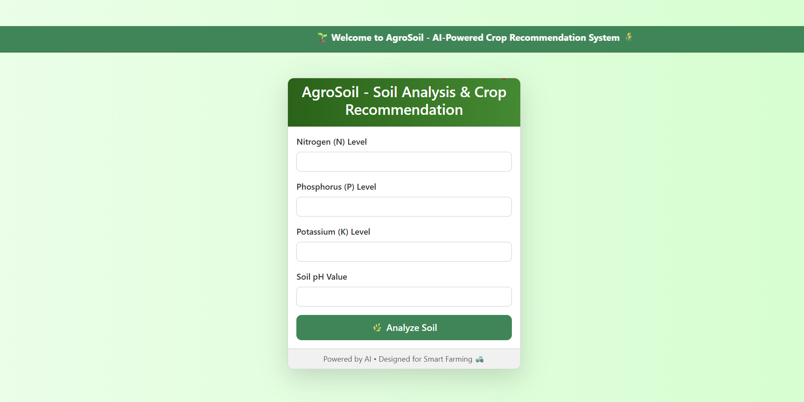

# 🌱 AgroSoil: AI-Powered Crop Recommendation System

AgroSoil is a smart agriculture tool that uses **Machine Learning** to recommend the best crop based on your soil's nutrient profile (Nitrogen, Phosphorus, Potassium) and pH level. It features a clean, mobile-friendly web interface built using **Flask** and **Bootstrap**.

---

## 🚀 Features

- 🔍 Analyze soil health using N, P, K, and pH inputs
- 🌾 Recommend optimal crops with a trained ML model
- 📊 User-friendly interface for farmers and agronomists
- 🧠 Backend powered by a machine learning classifier
- 💡 Fully open-source and ready for deployment

---

## 🛠️ Tech Stack

- Python 3
- Flask (Web Framework)
- Scikit-learn (Machine Learning)
- Bootstrap 5 (Frontend UI)
- HTML/CSS/JS

---

## 📷 UI Preview



---

## 📦 Installation & Usage

```bash
# Clone the repository
git clone https://github.com/YOUR-USERNAME/AgroSoil-ML.git
cd AgroSoil-ML

# (Optional) Create a virtual environment
python -m venv venv
source venv/bin/activate    # On Windows: venv\Scripts\activate

# Install dependencies
pip install -r requirements.txt

# Train the model
python train_model.py

# Run the web app
cd app
python app.py
